# Життєвий цикл проєкту (Project Life Cycle)

## 1. Обрана модель життєвого циклу

* **Конкретна модель:** Scrum (адаптивна ітеративна розробка з елементами швидкого макетування на стадії проєктування).
* **Тип моделі за сучасною класифікацією:** Гібридна (поєднання передбачуваного календарного плану контрольних точок навчального курсу та адаптивних спринтів розробки Scrum).

### Обґрунтування вибору

Для проєкту «ГалюняBeauty» обрано гібридну адаптивну модель на основі фреймворку Scrum. З одного боку, проєкт виконується в умовах академічного навчального середовища, що накладає жорсткі зовнішні часові обмеження (контрольні точки лабораторних робіт та фіксовану дату завершення семестру), що потребує предиктивної фази ініціації та структурованих фазових воріт. З іншого боку, сам продукт має середній рівень невизначеності вимог щодо інтерфейсу бронювання, логіки скасувань і формату сповіщень, що виключає можливість завчасного детального проєктування всієї системи. Застосування коротких двотижневих спринтів у фазі виконання дозволяє команді із 5 осіб за обмеженого ресурсу часу (6–10 годин на тиждень на учасника) послідовно випускати працездатні інкременти продукту, оперативно тестувати їх на мобільних пристроях та коригувати беклог без ризику зриву підсумкового дедлайну.

---

## 2. Фази життєвого циклу

Життєвий цикл проєкту триває 12 тижнів і складається з 6 послідовних фаз, де фаза безпосереднього виконання представлена трьома ітеративними спринтами.

| № | Назва фази | Мета фази | Тривалість (тижнів) | Ключові роботи | Deliverables (проміжні результати) | Відповідальний |
| :--- | :--- | :--- | :---: | :--- | :--- | :--- |
| 1 | **Концептуальна (Ініціація)** | Сформулювати концепцію продукту, визначити межі проєкту та дослідити оточення | 2 | Дослідження цільової аудиторії (майстрів і клієнтів), аналіз ринкових аналогів (Altegio, Dikidi), проведення проблемних інтерв'ю, розподіл ролей у команді та узгодження каналів комунікації | Затверджені документи `project-brief.md` та `project-classification.md`, первинний перелік вимог до MVP | Денис Войтенко (Analyst) |
| 2 | **Розробка (Планування та дизайн)** | Спроєктувати користувацький інтерфейс, зафіксувати системну архітектуру та сформувати беклог | 2 | Створення інтерактивних UI/UX-макетів у Figma з орієнтацією на Mobile-First, вибір технологічного стеку (Node.js, PostgreSQL/SQLite, веб-фронтенд), декомпозиція та пріоритизація завдань за методом MoSCoW, налаштування Git-репозиторію | Клікабельний Figma-прототип інтерфейсу, схема бази даних, структурований беклог продукту, план спринтів | Дар'я Репіна (Designer) |
| 3 | **Виконання: Спринт 1 (Каталог та базовий UI)** | Створити клієнтський каркас веб-застосунку та модуль вибору послуг | 2 | Верстка адаптивного вебінтерфейсу, реалізація списку послуг із фільтрацією за категоріями, відображення цін і тривалості процедур, базова клієнтська валідація, налаштування тестового хостингу | Працездатний веб-інтерфейс каталогу послуг і вибору спеціаліста (Інкремент 1), опублікований на тестовому стенді | Максим Балла (Tech Lead) |
| 4 | **Виконання: Спринт 2 (Розклад та бронювання)** | Реалізувати календарний графік майстра та механізм бронювання слотів без овербукінгу | 2 | Розробка бекенд-логіки генерації вільних часових вікон, створення механізму блокування зайнятих слотів у базі даних, реалізація інтерфейсу розкладу для майстра та форми швидкого запису для клієнта | Функціональний модуль вибору часу та підтвердження бронювання з робочим кабінетом майстра (Інкремент 2) | Михайло Дубравський (Developer) |
| 5 | **Виконання: Спринт 3 (Сповіщення та тестування)** | Автоматизувати комунікацію з користувачами та провести наскрізне тестування | 2 | Інтеграція з Telegram Bot API для відправки підтверджень та автоматичних нагадувань про сеанс, реалізація скасування візиту, проведення модульного та функціонального тестування, оптимізація швидкодії | Інтегрована система сповіщень через месенджер, протокол тестування, стабільна збірка MVP без блокуючих дефектів (Інкремент 3) | Максим Балла (Tech Lead) |
| 6 | **Завершення (Впровадження та здача)** | Фіналізувати документацію, виконати релізне розгортання та захистити проєкт | 2 | Розгортання релізної версії на постійному веб-сервері, підготовка інструкції користувача для майстра та клієнта, підбиття підсумків, оформлення фінального звіту та презентації для захисту | Опублікований діючий веб-сервіс, повний комплект документації репозиторію, презентація проєкту | Петро Антонюк (Project Manager) |

---

## 3. Ворота між фазами (Phase Gates)

Між фазами визначено 5 воріт контролю якості та доцільності продовження робіт. На кожних воротах команда оцінює критерії переходу та приймає рішення: **Go** (перехід до наступної фази), **Rework** (доопрацювання поточної фази в межах резерву часу) або **Kill** (зупинка чи суттєвий перегляд проєкту за умови критичної нездійсненності).

| Ворота | Між фазами | Критерії переходу | Можливі рішення |
| :--- | :--- | :--- | :--- |
| **G1** (Gate 1: Схвалення концепту) | Фаза 1 → Фаза 2 | 1. Документи `project-brief.md` та `project-classification.md` сформовані, відповідають стандарту та схвалені командою. 2. Підтверджено наявність попиту на функціонал швидкого онлайн-запису серед опитаних потенційних користувачів. 3. Усі 5 ролей у команді розподілені, узгоджено робочі обов'язки та тижневий бюджет часу. | **Go** / **Rework** / **Kill** |
| **G2** (Gate 2: Схвалення архітектури та дизайну) | Фаза 2 → Фаза 3 | 1. Інтерактивні макети ключових екранів у Figma пройшли внутрішнє тестування ергономіки на мобільних пристроях. 2. Стек технологій остаточно обрано та перевірено на сумісність із безкоштовною інфраструктурою. 3. Беклог продукту декомпозовано на окремі атомарні таски на дошці завдань, критерії готовності (DoD) зафіксовано. | **Go** / **Rework** / **Kill** |
| **G3** (Gate 3: Огляд інкременту 1) | Фаза 3 → Фаза 4 | 1. Каталог послуг і майстрів коректно рендериться на смартфонах та десктопах. 2. Веб-інтерфейс успішно розгорнуто в мережі Інтернет на тестовому хостингу. 3. Код пройшов внутрішній code review, критичні помилки верстки відсутні. | **Go** / **Rework** / **Kill** |
| **G4** (Gate 4: Огляд інкременту 2) | Фаза 4 → Фаза 5 | 1. Логіка вибору слотів працює коректно; транзакційне блокування запобігає одночасному бронюванню однакового часу двома користувачами (захист від овербукінгу). 2. Майстер бачить актуальний розклад у реальному часі. 3. Інтерфейс успішно обробляє крайні випадки (неробочий час, перерви). | **Go** / **Rework** / **Kill** |
| **G5** (Gate 5: Готовність MVP до релізу) | Фаза 5 → Фаза 6 | 1. Telegram-бот своєчасно надсилає повідомлення про створення запису та нагадування за визначений час. 2. Усі виявлені критичні та серйозні дефекти за результатами тестування виправлено. 3. Застосунок відповідає базовим вимогам захисту персональних даних користувачів. | **Go** / **Rework** / **Kill** |

---

## 4. Візуалізація життєвого циклу

Нижче наведено діаграму життєвого циклу проєкту у форматі Mermaid, що відображає послідовність фаз, контрольні ворота рішень та ітераційні цикли повернення на доопрацювання (Rework).

```mermaid
flowchart TD
    subgraph P1["Фаза 1: Концептуальна (Ініціація)"]
        A["Дослідження потреб, конкурентів,<br/>створення project-brief та classification"]
    end

    G1{"G1: Концепт і вимоги<br/>затверджено?"}
    A --> G1
    G1 -->|Rework| A

    subgraph P2["Фаза 2: Розробка (Планування та дизайн)"]
        B["Figma-макети Mobile-First,<br/>архітектура БД та беклог задач"]
    end
    G1 -->|Go| B

    G2{"G2: Архітектуру і дизайн<br/>схвалено?"}
    B --> G2
    G2 -->|Rework| B

    subgraph Execution["Фаза Виконання (Адаптивні ітерації)"]
        subgraph P3["Фаза 3: Спринт 1"]
            C["Розробка адаптивного каталогу<br/>послуг та вибору майстра"]
        end
        G3{"G3: Інкремент 1<br/>перевірено?"}
        C --> G3
        G3 -->|Rework| C

        subgraph P4["Фаза 4: Спринт 2"]
            D["Логіка вибору слотів, захист<br/>від овербукінгу, розклад майстра"]
        end
        G3 -->|Go| D
        G4{"G4: Інкремент 2<br/>перевірено?"}
        D --> G4
        G4 -->|Rework| D

        subgraph P5["Фаза 5: Спринт 3"]
            E["Інтеграція Telegram Bot API,<br/>сповіщення та наскрізне тестування"]
        end
        G4 -->|Go| E
        G5{"G5: MVP готовий<br/>до релізу?"}
        E --> G5
        G5 -->|Rework| E
    end
    G2 -->|Go| C

    subgraph P6["Фаза 6: Завершення (Впровадження)"]
        F["Релізне розгортання в хмарі,<br/>документація та захист проєкту"]
    end
    G5 -->|Go| F
```

---

## 5. Обґрунтування вибору моделі

Вибір моделі життєвого циклу зумовлений поєднанням ключових характеристик проєкту, виявлених під час його класифікації (Лабораторна робота №2). Проєкт «ГалюняBeauty» є малим стартап-орієнтованим веб-застосунком із середнім рівнем невизначеності вимог, що реалізується командою з 5 студентів за нульового фінансового бюджету та лімітованого фонду часу (35–45 людино-годин на тиждень). У таких умовах надзвичайно важливо мінімізувати період між формулюванням гіпотези щодо інтерфейсу та її перевіркою в реальному браузері на мобільному телефоні, що робить ітеративну розробку спринтами критично необхідною.

У процесі планування команда розглядала класичну каскадну (Waterfall) та V-подібну моделі, проте обидві були відхилені. Каскадний підхід вимагає повної фіксації всіх вимог та деталей інтерфейсу на ранній стадії розробки. Якщо на етапі фінального тестування виявиться, що форма бронювання надто громіздка для клієнта, змінити її без зриву загального дедлайну семестру було б неможливо. V-подібна модель, хоч і орієнтована на забезпечення надійності, передбачає надмірний обсяг попередньої тестової документації, на складання якої у студентської команди немає ресурсу часу. Модель RAD (Rapid Application Development) також була відхилена, оскільки вона спирається на наявність постійного зовнішнього бізнес-замовника для щоденного зворотного зв'язку, що не відповідає моделі ініціативного навчального стартапу.

Обрана гібридна модель на основі Scrum забезпечує три вагомі переваги. По-перше, вона фокусує команду на регулярному отриманні робочих артефактів: після кожного двотижневого спринту з'являється новий функціональний інкремент (каталог → модуль слотів → бот сповіщень). По-друге, поетапна розробка захищає проєкт від перевантаження зайвими функціями: беклог завжди можна скоротити до меж критичного MVP без шкоди для вже створеного коду. По-третє, наявність формальних контрольних воріт (G1–G5) гарантує, що перехід до наступного етапу відбувається лише за умови повної перевірки попередньої частини, унеможливлюючи накопичення прихованих критичних дефектів.

Основними ризиками обраної моделі є ризик розповзання меж проєкту (scope creep), нерівномірна завантаженість учасників під час сесійних контрольних робіт і накопичення технічного боргу через швидкі темпи ітерацій. Для нейтралізації цих ризиків команда впроваджує такі заходи:
1. Межі функціоналу MVP фіксуються за правилом MoSCoW, і завдання категорії «Could Have» заборонено брати в спринт до завершення критичних вимог.
2. Тривалість спринтів жорстко обмежена двома тижнями, а завдання розподіляються з урахуванням піків навчального навантаження студентів.
3. Кожен інкремент проходить обов'язковий етап взаємного code review перед затвердженням на фазових воротах, що запобігає деградації якості коду.
